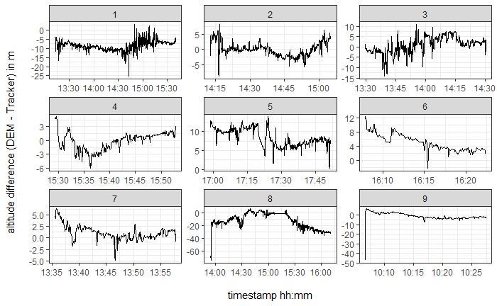

```{r setup, include=FALSE}
knitr::opts_chunk$set(echo = TRUE)
```

```{r, message = FALSE, include=FALSE}
library(rgdal) 
library(sf)
library(tidyverse)
library(lubridate)
library(zoo)
library(purrr)
library(base)
library(ggpubr)

if(!requireNamespace("remotes")) {
    install.packages("remotes")
}
remotes::install_github("grimbough/FITfileR")

library(FITfileR)
library(gdata)
library(plotly)

#Packages for DEM import and handling
library(raster)
library(tiff)

library(MuMIn)

```

## Abstract

In this semester project, sports tracks are analysed using GPS data from a "Garmin" device to identify specific behavior patterns in outdoor sports (jogging). Furthermore, the time required for sporting activities is modeled based on the individual fitness level, so that a user-specific forecast of the time required for sporting activities is possible. Model inputs are the distance and altitude differences (upwards and downwards).

# Table of contents

1.  [Introduction](#introduction)

    1.1 [Research questions](#subparagraph1)

2.  [Methods](#methods)

    2.1 [Data sources and import](#subparagraph2)

    2.2 [Evaluation of data](#subparagraph3)

    2.3 [Model individual time requirement](#subparagraph4)

3.  [Results](#paragraph2)

    3.1 [Research Question 1](#subparagraph5)

    3.2 [Research Question 2](#subparagraph6)

    3.3 [Research Question 3](#subparagraph7)

4.  [Disussion](#paragraph3)

    4.1 [Discussionpoint1](#subparagraph8)

    4.2 [Further studies](#subparagraph9)

5.  [Appendix](#paragraph4)

## 1 Introduction <a name="introduction"></a> {#introduction}

Sport watches are a popular tool to monitor and regulate training activities among both professional and amateur athletes. Depending on the product, in addition to GPS data, they also record altitude (e.g. based on air pressure) heart rate or further attributes. This collected data can thus serve to predict some own behavior patterns, such as fitness progress, stress, etc. In this work, it will be evaluated whether existing tracks of an athlete can be used to predict the individual time for a given route. This service is already available on different online-platforms such as googlemaps or "SchweizMobil", but neither the fitness level, age, weight, nor the gender are taken into account for those calculations. Here, apps can be used which analyze those different parameters individually. However, to enable this interpretation step, there is a need of a) evaluating the accuracy of the measured data and b) determining the variables that lead to the desired output (in our case a time estimation). In the study by @gilgen-ammann2020a, the accuracy of the recorded distances of eight commercially available sports watches from Apple, Coros, Garmin, Polar and Suunto was examined in different areas and at different speeds. The results showed that the recorded systematic errors (±limits of agreements) when all measurement areas combined ranged between 3.7 (±195.6) m and -101.0 (±231.3) m, and the mean absolute percentage errors ranged from 3.2% to 6.1%. These results lead to the conclusion that the acquired coordinates should be aligned with a suitable digital elevation model DEM (e.g. SwissALTI3D) before further use of the data.

### 1.1 research questions <a name="subparagraph1"></a>

1.  What are the most relevant influencing variables on the athlete's time requirement and speed in the analysed data?

2.  What behaviour patterns (e.g. pausing, moving) can be identified from the data? Are these behaviour patterns related to distance and altitude differences? Can patterns in behaviour be identified that are harmful to health? (Comparison of heart rate curve with recommended maximum heart rate).

3.  How reliably can the time required for sporting activities be predicted based on a user's individual fitness level? A model is created from past GPS tracks, which is validated using a self-experiment (determine new route using "SchweizMobil", model time requirement and check in a self-experiment).

## 2 Methods <a name="methods"></a> {#methods}

### 2.1 Data sources and import <a name="subparagraph2"></a>

The data which can be obtained via the Garmin portal comes within the .fit format. The raw .fit file include spatio-temporal information , such as timestamp, position (Latitude and Longitude) as well as other variables like heart-rates, distance, enhanced-speed, enhanced-altitude (air pressure based) and cadence (cadence is defined as the total number of steps per minute).

A dataset (data.frame) was generated using sports tracks data from a garmin-sportwatch from two different anonymous athletes (athlete 01, athlete 02). For this purpose, the files of every athlete must be labeled with *\_a1* or *\_a2* right before the file extension *.fit* and saved in the project directory in advance. Thus, files from from athlete 1 always are labeled with *\_a1.fit* at the end of the file name. An example of a track by athlete 01 would be: *"6128842359_ACTIVITY_a1.fit".*

A for loop detects all files from athlete 1 and athlete 2 in the project directory. All files per athlete will be combined into one dataset (data.frame) and labeled with a unique athlete ID. For the further steps, the user must specify which athlete is to be considered. This choice is made via the parameter *"Pick Athlete"* in the r-Code*.*

```{r message=FALSE, warning=FALSE, include=FALSE, paged.print=FALSE}
############### Filter data fro one athlete only (andd)
# Files of every ahtlete must be labelled with _a1, _a2 or a_3 before the .fit extension.

#  Get all the files per athlete
myfiles_a1 <- list.files(".",pattern = "*a1.fit")
myfiles_a2 <- list.files(".",pattern = "*a2.fit")
myfiles_a3 <- list.files(".",pattern = "*a3.fit")

# Import files from athlete 1 temporary
for (i in 1:length(myfiles_a1)) {
  varName <- paste0("temp_a1", i, ".fit")
  assign(varName, as.data.frame(records(readFitFile(myfiles_a1[i]))))
}

# Bind row for athlete 1 temporary, label as athelte 1
a1 <- mget(ls(pattern="temp_a1")) %>%
              bind_rows() %>%
  mutate(athlete = 1)

# Import files from athlete 2 temporary
for (i in 1:length(myfiles_a2)) {
  varName <- paste0("temp_a2", i, ".fit")
  assign(varName, as.data.frame(records(readFitFile(myfiles_a2[i]))))
}

# Bind rows from athlete 2 temporary, label as athelte 2
a2 <- mget(ls(pattern="temp_a2")) %>%
              bind_rows() %>%
  mutate(athlete = 2)

# Bind files from all athletes using rowbind.
full <- bind_rows(a1, a2)

keep(full, sure = TRUE)


# Filter the whole data according to athlete to be analysed: Pick an athlete!
Pick_Athlete <- 1

full <- full %>%
  filter(athlete == Pick_Athlete)

############# Filter here! User defines which athlete is considered (andd)

#check full
head(full)
```

### 2.2 Preparation and evaluation of data <a name="subparagraph3"></a>

In order to distinguish between the different tracks of an athlete, an individual ID per track had to be created first. This was fulfilled by determining the time lag first, i.e. the time that elapsed between 2 recorded points. A new "activity_ID" was then given if timelag \> 1 hour (3600s). As timelags between

```{r message=FALSE, warning=FALSE, include=FALSE, paged.print=FALSE}
# Calculate timelag
full$timelag <- as.integer(difftime(full$timestamp, lag(full$timestamp)))
# activity_ID (new ID if timelag > 1 hour)
full$activity_conter <- ifelse(abs(full$timelag) > 3600, TRUE, FALSE) 
full$activity_conter[1] <- TRUE  # ID 1 = TRUE, as this is activity one
full$activity_ID <- cumsum(full$activity_conter == TRUE)  # create acitiviy_ID based on counter
```

Since time steps between individual activities are not relevant, the timelag is subsequently overwritten by only calculating timelags within a group with the same activity_ID. This excludes times between activities.

```{r message=FALSE, warning=FALSE, include=FALSE, paged.print=FALSE}
full <- full %>%
  dplyr::group_by(activity_ID) %>%
  mutate(timelag = as.integer(difftime(timestamp, lag(timestamp))))
summary(full$timelag)
```

Some variables like distance, speed ("enhanced_speed") and altitude ("enhanced_altitude") are already available in the .fit files, they are compared with the self calculated results.

The distance recorded by the watch was compared with calculated Euclidean step length. To calculate euclidean distance, an sf data.frame was created and converted to Swiss national coordinate system CH1903+ LV95.

```{r message=FALSE, warning=FALSE, include=FALSE, paged.print=FALSE}
# Create sf and convert to CH1903+ LV95 to calculate the euculidian distance
full_sf <- st_as_sf(full, coords = c("position_long", "position_lat"),
         crs = 4326)
full_sf <- st_transform(full_sf, crs = 2056)

options(digits = 3)

# get x and y coordinates from sf geometry
full_sf$x <- st_coordinates(full_sf$geometry)[,1]
full_sf$y <- st_coordinates(full_sf$geometry)[,2]
```

To evaluate the altitude data of the device derived from air pressure, a suitable digital elevation model (DEM) was found and used in order to compare the information of the .fit files. Such a DEM is available as Cloud Optimized GeoTIFF from Swisstopo and is called "SwissALTI3D". A low raster size of 2m was used to achieve high quality information. The DEM is divided into different GeoTIFF files, each covering an area of one square kilometre. Reading and merging all DEM Files from Switzerland or the Canton of St.Gallen would be very time consuming. Therefore, the area of investigation was defined on the basis of the tracks read in and then only the necessary DEM raster files were imported.

The URLs to the files consist of a fixed part and a part dependent on the location. This dependent part was determined on the basis of the examination area. For this purpose, each x- and y-coordinate was floor rounded to a kilometre. All unique combinations of rounded x- and y-coordinates were then listed and the necessary URLs defined by the unique combinations and the fixed part of the links. As the URLs contain the date of the latest reevaluation of the model, some links contain the the number 2019 while some others contain the number 2020. Thus, all the links were created twice (each for 2019 and 2020). In comparison to the complete list of all available DEM files in Switzerland, the correct URLs (containing the year 2019 or 2020) were selected and used for the import of the DEM. For this purpose, a for loop was programmed, which downloads the required files from the URLs described before and merges them into a single raster.

```{r message=FALSE, warning=FALSE, include=FALSE, paged.print=FALSE}
##  digital elevation model to verify altitude for each GPS location
#    we only import the necesary data now!

# Create a Dataframe containing all positions (floor-rounded to 1km) as information source for required DHM-rasters
DHM_rasters <- data.frame(
  x = floor(full_sf$x / 1000),
  y = floor(full_sf$y / 1000)
)
# There are NA's when GPS-Position wasn't found (Activity_ID = 19) => Exclude them!
DHM_rasters <- filter(DHM_rasters, x > 0)

# Only keep the unique combinations for rounded x and y
DHM_rasters <- unique(DHM_rasters[c("x", "y")])

# Create the Download-Links of the tiff-files from Swisstopo: 
#  Sometimes data is from 2020, sometimes from 2019. Links aren't the same. So every combination has to be produced for 2019 data and 2020 data.
DHM_URL <- c(
  paste("https://data.geo.admin.ch/ch.swisstopo.swissalti3d/swissalti3d_2019_", DHM_rasters$x, 
        "-", DHM_rasters$y, "/swissalti3d_2019_", DHM_rasters$x, "-", DHM_rasters$y, 
        "_2_2056_5728.tif", sep = ""),
  paste("https://data.geo.admin.ch/ch.swisstopo.swissalti3d/swissalti3d_2020_", DHM_rasters$x, 
        "-", DHM_rasters$y, "/swissalti3d_2020_", DHM_rasters$x, "-", DHM_rasters$y,
        "_2_2056_5728.tif", sep = ""))

# Create a data.frame for join later...
DHM_URL <- as.data.frame(DHM_URL)

# Read all available DEM-sources for whole Switzerland
DHM_full <- read_csv("DHM_CH.csv", col_names = "DHM_URL")

# Keep only DEM-sources, which are available in the source DHM_full (wohle Switzerland)
#  This ensures that the correct link (2019 or 2020) is chosen from DHM_full
DHM_required <- inner_join(DHM_URL, DHM_full)

# Now import all the required URL's as raster-list
r.list <- list()
for(i in 1:length(DHM_required$DHM_URL)){  
  r.list[[i]] <- raster(DHM_required$DHM_URL[i])  
} 

```

As shown in the plot below, only the DEM-rasters of the observation area have been imported. The points show all the x and y coordinates that have been tracked by the athlete.

```{r echo=FALSE, message=FALSE, warning=FALSE, fig.cap="Figure 1: Digital elevation model (DEM) of the overservation area and all x and y coordinates of the analysed tracks"}
# Create a Rasterlayer from raster-list
m <- do.call(merge, r.list)

# Visialize imported data
plot(m)  # This should exactly cover the tracks used until now.
points(full_sf$x, full_sf$y)   # Add all points to the DEM-Graphic
```

Finally, the height information from the DEM could be extracted for every single x- and y-coordinate of the tracks to be analysed. By joining the hight information from the DEM with the coordinates of the tracks the accuracy of the elevation measurement by the pressure was possible. Since the pressure measurement leads to constant fluctuations in the altitude information, the altitude information from the DEM is considered more reliable and is used for subsequent evaluations.

```{r message=FALSE, warning=FALSE, include=FALSE, paged.print=FALSE}
# Reading of other tracks all over switzerland will result in the import of the required rasters above!! :)

# Extract elevation information from rasterlayer
data.matrix <- as.data.frame(rasterToPoints(m))

# Create identical names for join:
names(data.matrix)[names(data.matrix) == "x"] <- "x_round"
names(data.matrix)[names(data.matrix) == "y"] <- "y_round"

# create rounded x and y as join-key => every two meters, always odd values!
full_sf$x_round <- as.numeric(2 * round(full_sf$x/2) + 1)  
full_sf$y_round <- as.numeric(2 * round(full_sf$y/2) + 1)


# Join elevation 
full_sf <- left_join(full_sf, data.matrix, by = c("x_round", "y_round"))

#####  dplyr::rename  => change layer to altitude_DEM (andd)

# Calculate altitude difference between pressure measurement and DHM layer.
full_sf$altitude_diff <- full_sf$layer - full_sf$enhanced_altitude
```

Moreover, a rolling window function with different k-values was generated in order to smoothen the time step-values. With this, speed was also calculated, compared with the data from the sportwatch (enhanced_speed multiplied by 3.6 to get the unit km/h) and plotted. The plots of 6 randomly selected tracks show that there are hardly any deviations between distance (and speed) from the .fit file and the calculated distance / speed values. Therefore, the distances from the sports watch are used for further calculations.

### 2.3 Model individual time requirement <a name="subparagraph4"></a>

To model the time requirement of an activity, distance and altitude differences (upwards and downwards) were used as predictors in a first step. Subsequently, the model was refined by including fatigue (based on the time estimation of the model). Fatigue was included because the first model led to a systematic overestimation of the time needed for short activities, whereas the time needed for longer activities was underestimated.

Simple Model: Before starting with a Multimodel Inference (Multiple Regession), the activities were segmented in increments of one minute. Using multimodel inference, all predictors were checked for their importance. Subsequently, the model with the highest AICc value was selected to model the individual time requirement of athletes.

Exhaustion Model: Due to exhaustion, the simple model leads to an overestimation of the time requirement for short activities and tends to underestimate it for longer activities. For this reason, the fatigue component is added to the model. For this purpose, the time difference between prediction and measurement of each track is used and calculated using a linear model based on the duration of the prediction. This results in a lower time requirement for short activities and a higher time requirement for longer activities. The slope of the linear model increases due to this correction, but by reducing the intercept, the time requirement decreases for short activities.

## 3 Results <a name="paragraph2"></a>

### 3.1 Data preparation <a name="subparagraph1"></a>

#### 3.1.2 Comparison tracked data vs. calculated data <a name="subparagraph1"></a>

**A) Distance**

The comparison between the recorded distances and those from Eucliedean Distance shows that..


**B) speed**

The comparison between the recorded speed values and those from Eucliedean Distance and timestap show..




**C) Altitude**

evaluate altitude with DEM



### 3.3 Research Question 1 <a name="subparagraph1"></a>

To answer research question 1, an exploratory data analysis (EDA) of the collected tracks was first conducted.

{width="557"}

[plot](http://127.0.0.1:5813 "plot"): A: altitude difference down, B: altitude difference up for track 2, athlete 1

The Shiny app was programmed to browse through the different tracks of an athlete. Via dropdown menu it is possible to choose between the different tracks:

```{r echo = FALSE}

#all codes for shiny app ---------------

library(rgdal) 
library(sf)
library(tidyverse)
library(lubridate)
library(zoo)
library(purrr)
library(base)
library(ggpubr)

if(!requireNamespace("remotes")) {
    install.packages("remotes")
}
remotes::install_github("grimbough/FITfileR")

library(FITfileR)
library(gdata)
library(plotly)

#Packages for DEM import and handling
library(raster)
library(tiff)
# Files of every ahtlete must be labelled with _a1, _a2 or a_3 before the .fit extension.

#  Get all the files per athlete
myfiles_a1 <- list.files(".",pattern = "*a1.fit")
myfiles_a2 <- list.files(".",pattern = "*a2.fit")
myfiles_a3 <- list.files(".",pattern = "*a3.fit")

# Import files from athlete 1 temporary
for (i in 1:length(myfiles_a1)) {
  varName <- paste0("temp_a1", i, ".fit")
  assign(varName, as.data.frame(records(readFitFile(myfiles_a1[i]))))
}

# Bind row for athlete 1 temporary, label as athelte 1
a1 <- mget(ls(pattern="temp_a1")) %>%
              bind_rows() %>%
  mutate(athlete = 1)

# Import files from athlete 2 temporary
for (i in 1:length(myfiles_a2)) {
  varName <- paste0("temp_a2", i, ".fit")
  assign(varName, as.data.frame(records(readFitFile(myfiles_a2[i]))))
}

# Bind rows from athlete 2 temporary, label as athelte 2
a2 <- mget(ls(pattern="temp_a2")) %>%
              bind_rows() %>%
  mutate(athlete = 2)

# Import files from athlete 3 temporary
for (i in 1:length(myfiles_a3)) {
  varName <- paste0("temp_a3", i, ".fit")
  assign(varName, as.data.frame(records(readFitFile(myfiles_a3[i]))))
}

# Bind rows from athlete 2 temporary, label as athelte 3
a3 <- mget(ls(pattern="temp_a3")) %>%
              bind_rows() %>%
  mutate(athlete = 3)

# Bind files from all athletes using rowbind.
full <- bind_rows(a1, a2, a3)

keep(full, sure = TRUE)

#check full
head(full)

# speed from tracker in km/h
full$enhanced_speed_kmh <- full$enhanced_speed *3.6

# Create sf and convert to CH1903+ LV95 to calculate the euculidian distance
full_sf <- st_as_sf(full, coords = c("position_long", "position_lat"),
         crs = 4326)
full_sf <- st_transform(full_sf, crs = 2056)

options(digits = 3)

# get x and y coordinates from sf geometry
full_sf$x <- st_coordinates(full_sf$geometry)[,1]
full_sf$y <- st_coordinates(full_sf$geometry)[,2]


##  digital elevation model to verify altitude for each GPS location
#    we only import the necesary data now!

# Create a Dataframe containing all position (floor-rounded to 1km) as information source for required DHM-rasters
DHM_rasters <- data.frame(
  x = floor(full_sf$x / 1000),
  y = floor(full_sf$y / 1000)
)
# There are NA's when GPS-Position wasn't found (Activity_ID = 19) => Exclude them!
DHM_rasters <- filter(DHM_rasters, x > 0)

# Only keep the unique combinations for rounded x and y
DHM_rasters <- unique(DHM_rasters[c("x", "y")])

# Create the Download-Links of the tiff-files from Swisstopo: 
#  Sometimes data is from 2020, sometimes from 2019. Links aren't the same. So every combination has to be
#  produced for 2019 data and 2020 data.
DHM_URL <- c(
  paste("https://data.geo.admin.ch/ch.swisstopo.swissalti3d/swissalti3d_2019_", DHM_rasters$x, 
        "-", DHM_rasters$y, "/swissalti3d_2019_", DHM_rasters$x, "-", DHM_rasters$y, 
        "_2_2056_5728.tif", sep = ""),
  paste("https://data.geo.admin.ch/ch.swisstopo.swissalti3d/swissalti3d_2020_", DHM_rasters$x, 
        "-", DHM_rasters$y, "/swissalti3d_2020_", DHM_rasters$x, "-", DHM_rasters$y,
        "_2_2056_5728.tif", sep = ""))

# Create a data.frame for join later...
DHM_URL <- as.data.frame(DHM_URL)

# Read all available DEM-sources for whole Switzerland
DHM_full <- read_csv("DHM_CH.csv", col_names = "DHM_URL")

# Keep only DEM-sources, which are available in the source DHM_full (wohle Switzerland)
#  This ensures that the correct link (2019 or 2020) is chosen from DHM_full
DHM_required <- inner_join(DHM_URL, DHM_full)

# Now import all the required URL's as raster-list
r.list <- list()
for(i in 1:length(DHM_required$DHM_URL)){  
  r.list[[i]] <- raster(DHM_required$DHM_URL[i])  
} 

# Create a Rasterlayer from raster-list
m <- do.call(merge, r.list)

# Visialize imported data
plot(m)  # This should exactly cover the tracks used until now. 
# Reading of other tracks all over switzerland will result in the import of the required rasters above!! :)

# Extract elevation information from rasterlayer
data.matrix <- as.data.frame(rasterToPoints(m))

# Create identical names for join:
names(data.matrix)[names(data.matrix) == "x"] <- "x_round"
names(data.matrix)[names(data.matrix) == "y"] <- "y_round"

# create rounded x and y as join-key => every two meters, always odd values!
full_sf$x_round <- as.numeric(2 * round(full_sf$x/2) + 1)  
full_sf$y_round <- as.numeric(2 * round(full_sf$y/2) + 1)

# Join elevation 
full_sf_join <- left_join(full_sf, data.matrix, by = c("x_round", "y_round"))

# Calculate altitude difference between pressure measurement and DHM layer.
full_sf_join$altitude_diff <- full_sf_join$layer - full_sf_join$enhanced_altitude

full_long <- gather(full, type, value, enhanced_altitude:heart_rate, enhanced_speed_kmh)

library(shiny)
library(plotly)

#select plots which show graphically how the variables speed, altitude difference and heart rate behave.

#create function for generation of plots

plot_speed_altitude_heartrate_function <- function(track_ID){
  
  full_long %>%
  filter(activity_ID == track_ID) %>%
  ggplot(aes(timestamp, value, col = type)) +
  geom_line()+
  geom_point() +
  facet_wrap(~type, scales = "free",ncol = 1) +
  theme_bw() +
  theme(legend.position = "none") +
  labs(x = "\nUhrzeit in hh:mm", y = "Wert\n")
  
}

#count number of tracks (unique activity ID)
number_of_tracks <- length(unique(full$activity_ID))
number_of_tracks

all_plots_speed_altitude_heartrate <- list() #create empty array

#save plots in array "all_plots_speed_altitude_heartrate"
for (track_ID in 1:number_of_tracks) {
    all_plots_speed_altitude_heartrate[[track_ID]]<-plot_speed_altitude_heartrate_function(track_ID)
  }
#create userinterface ui with shiny
ui <-shinyUI(fluidPage(selectInput("selectPlot", "Choose desired track", choices=1:number_of_tracks), plotlyOutput("plot")))

server <- shinyServer(function(input,output){      
  output$plot <- renderPlotly({
    all_plots_speed_altitude_heartrate[[strtoi(input$selectPlot)]]
  })
})

#get userinterface 
shinyApp(ui,server)


```

--- output: html_document runtime: shiny ---

How altitude differences "up" affect speeds:

### 3.4 Research Question 2 <a name="subparagraph1"></a>

In this chapter the goal was to indicate specific behavioral patterns (e.g. speed, breaks, or similar) in the sports data and when they occur.

#### 3.4.1 Moving/breaking <a name="subparagraph1"></a>

In order to produce a model in chapter 3.5, some framework conditions must first be established. For this purpose, the length of the tracks, the actual running time and the breaks per track were identified.

To identify possible outliers,

The statistical analysis showed that track 1, 9, 14 should be removed and that the running time for the prediction model should not be longer than 3h (system boundary).


#### 3.4.2 Heart pulse <a name="subparagraph1"></a>

According to Such and Meyer (2010) the maximum heart rate (HRmax) is calculated as 220-age for running and 200-age for biking (rule of thumb). Also, women-specific calculations such as HFmax = 206 - (age x 0.88) (also rule of thumb) exist (Gulati et al). Since only data from male athletes exist in this work, it will not be used further. Therefore, it is important that the data used is up to date or at leas approximately the same as the current age.

According to the American Heart Association, the following target heart rate are recommended:

-   Moderate exercise intensity: 50% to about 70% of your maximum heart rate.

-   Vigorous exercise intensity: 70% to about 85% of your maximum heart rate.

For beginners the target heart rate will even be smaller. It is the athlete's choice which training level to select. However, it should not be higher than 85%.

Therefore

### 3.5 Research Question 3 <a name="subparagraph1"></a>

#### 3.5.1 Validation

In order to validate the model for each individual athlete,

A route (\<3h) has been chosen and the independent variables (length, altitude) were

## 4 Discussion <a name="discussion"></a> {#discussion}

A model could be established, which

### 4.1 Problems / Further studies<a name="subparagraph2"></a>

Factors which influence time requirement (and heart rate), include not only the route and its path circumstances, but also

-   Air-temperature / weather conditions

-   Age

-   Having disease such as cardiovascular disease, high cholesterol, diabetes etc.

-   Medications

-   Smoker/non-smoker

-   Emotions

## x References
